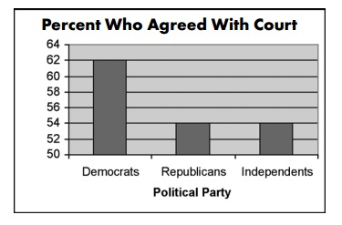
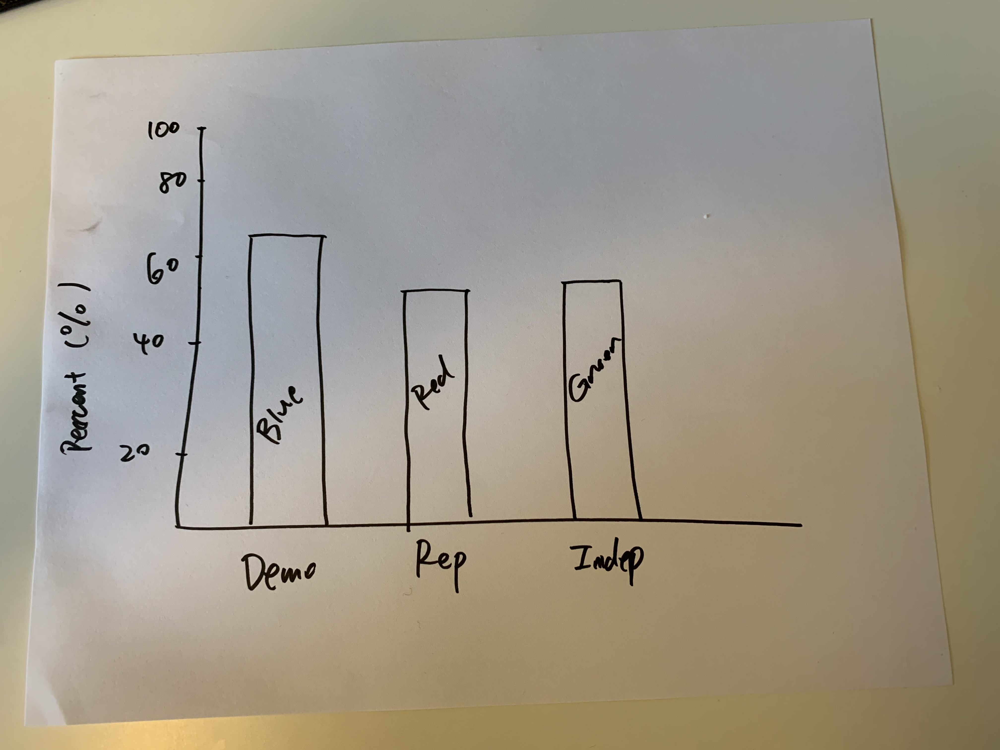

```{r setup, include = FALSE}
knitr::opts_chunk$set(echo = TRUE, message = FALSE, warning = FALSE)

# packages 
library(tidyverse)

# get your working directory (not a big fan of this practice; use .Rproj instead)
#YourWD <- getwd()
```

##  Problem 1

### a. 
```{r, echo = F, out.width = '100%', fig.align = 'center'}

```

Explain............

Source: Statistics How To "\href{https://www.statisticshowto.com/misleading-graphs/}{Misleading Graphs: Real Life Examples}" 

### b.

Critique............

### c.
```{r, echo = F, out.width = '85%', fig.align = 'center'}

```

Propose............

\newpage 

##  Problem 2

```{r, out.width = '85%', fig.align = 'center'}
df <- read_csv("https://faculty.washington.edu/cadolph/vis/iverRevised.csv")

df %>%
  ggplot(aes(x = povertyReduction , y = effectiveParties)) +
  geom_point()
```


