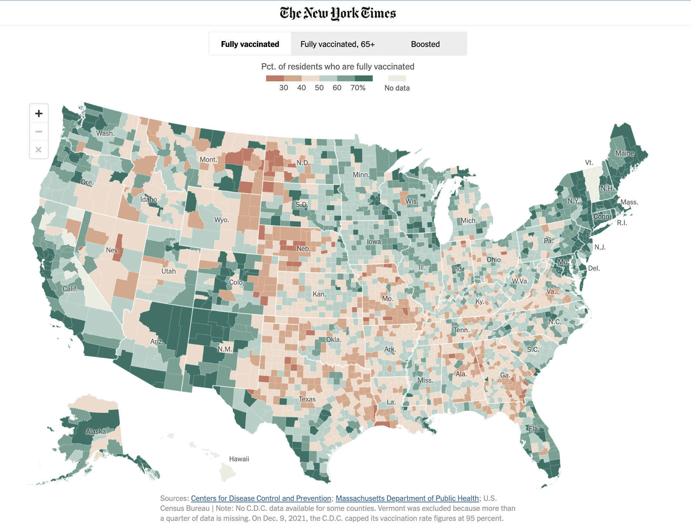
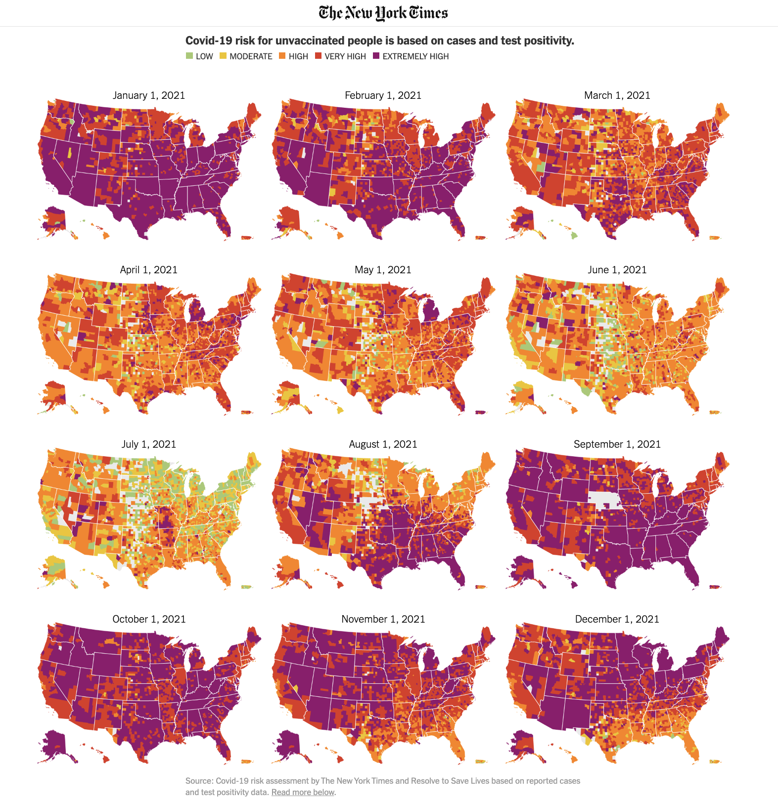
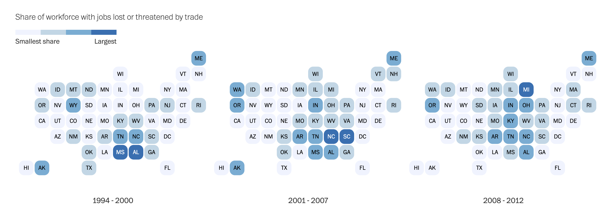

```{r setup, include=FALSE}
knitr::opts_chunk$set(fig.width = 12, message = FALSE, warning = FALSE, comment = "", cache = F)
library(flipbookr)
library(xaringan)
```


## Introduction

- Cover different ways to visualize spatial data:

--

- Geo-faceted small multiples

--

  - package **`geofacet`**

--

- Cartogram heatmaps

--

  - package **`statebins`**

--

- Choropleth maps (a.k.a. "maps'')

--

  - Brief introduction to spatial data file (e.g., shapefile; `.shp`)

--

  - package **`sf`** to wrangle spatial data and **`tmap`** to visualize map

--

  - Interactive maps; small multiples in choropleth maps

--

- Be mindful of the curse of dimensionality

--

  - how to incorporate time-series  or an extra covariate when visualizing spatial data? 

---

## Popular ways to visualize spatial data

```{r, echo = FALSE, out.width='45%', fig.align='center'}

```

---

## Popular ways to visualize spatial data

```{r, echo = FALSE, out.width='35%', fig.align='center'}

```

---

## Popular ways to visualize spatial data

```{r, echo = FALSE, out.width='37.5%', fig.align='center'}
knitr::include_graphics("pictures/Economist_geofacet.png")
```

---

## Popular ways to visualize spatial data

```{r, echo = FALSE, out.width='75%', fig.align='center'}

```

---

## Prerequisite

```{r}
# download packages 
packages <- c("tidyverse", "geofacet", "statebins", "sf", "tmap", "tigris")
not_installed <- setdiff(packages, rownames(installed.packages()))
if (length(not_installed)) install.packages(not_installed)

# load packages
library(tidyverse)
library(geofacet)
library(statebins)
library(sf)
library(tmap)
library(tigris)

# load theme
source("https://students.washington.edu/kpleung/vis/theme_cavis.R")
```

---

`r chunk_reveal("geofacet1", break_type = "auto", float = "top", widths = c(90, 10), title = "## Geo-faceted small multiples")`

```{r "geofacet1", include=F}
WaPo_data <- read_csv("data/WaPo_data.csv")

print(WaPo_data, n = 5)
```

---

`r chunk_reveal("geofacet2", break_type = "auto", float = "top", widths = c(90, 10), title = "## Geo-faceted small multiples")`

```{r "geofacet2", include=F}
# convert the data into long format
WaPo_data %>%
  select(-avgshare) %>%
  pivot_longer(contains("share_cut"), names_to = "year", values_to = "share_cut") %>%
  mutate(year = str_extract(year, "\\d+"),
         year = as.numeric(year)) ->
  WaPo_data_long
```

---

`r chunk_reveal("geofacet3", omit = "#ROTATE", break_type = "auto", widths = c(50, 50), title = "## Geo-faceted small multiples")`

```{r "geofacet3", include=F}
ggplot(WaPo_data_long, aes(x = year , y = share_cut)) +
  theme_cavis_hgrid +
  geom_line() +
  facet_wrap(~ state) + #OMIT
  facet_geo(~ state, grid = "us_state_grid2") + #ROTATE
  facet_geo(~ state, grid = "us_state_grid1") + #ROTATE
  scale_x_continuous(
    labels = function(x) paste0("'", str_sub(x, 3, 4))
  ) +
  scale_y_continuous(
    labels = function(x) paste0(x, "%")
  ) +
  theme(
    strip.text.x = element_text(size = 7),
    axis.text.x = element_text(size = 7),
    axis.text.y = element_text(size = 7)
  ) +
  labs(x = NULL, y = "Share of job loss due to trade")
```

---

`r chunk_reveal("geofacet3", omit = "#OMIT", break_type = "rotate", widths = c(50, 50), title = "## Geo-faceted small multiples")`

---

## Geo-faceted small multiples

- Check out the [available grids](https://hafen.github.io/geofacet/articles/geofacet.html) (users submitted)

--

- You can build your own grid using [Geo Grid Designer](https://hafen.github.io/grid-designer/) and make it a public good

---

## Cartogram Heatmaps 

```{r, echo = FALSE, out.width='75%', fig.align='center'}

```

---

`r chunk_reveal("statebins1", break_type = "auto", float = "top", widths = c(90, 10), title = "## Cartogram heatmaps with statebins package")`

```{r "statebins1", include = FALSE}
# coerce avgshare into a factor 
WaPo_data %>%
  select(stab, state, avgshare) %>%
  mutate(avgshare2 = cut(avgshare, 
                         breaks = 4, 
                         labels = c("0-1", "1-2", "2-3", "3-4"))) ->
  WaPo_data2 
```

---

`r chunk_reveal("statebins2", break_type = "non_seq", widths = c(50, 50), title = "## Cartogram heatmaps with statebins package")`

```{r "statebins2", include = FALSE}
WaPo_data2 %>%
  statebins(                                     #BREAK2
    value_col = "avgshare2",                     #BREAK2
    ggplot2_scale_function = scale_fill_brewer,  #BREAK2
    round = TRUE                                 #BREAK4
  ) +                                            #BREAK2
  theme_statebins() +                            #BREAK3
  scale_fill_brewer(                                  #BREAK5
    palette = "Blues",                                #BREAK5
    labels = c("Smallest\nshare", "", "", "Largest"), #BREAK5
    name = "Share of job loss due to trade") +        #BREAK5
  guides(fill = guide_legend(title.position = "top",       #BREAK6
                             label.position = "bottom")) + #BREAK6
  theme(legend.position = c(0, 0.85),         #BREAK7
        legend.direction = "horizontal",      #BREAK7
        legend.key.height = unit(0.2, "cm"),  #BREAK8
        legend.key.width = unit(1.6, "cm")    #BREAK8
        )                                     #BREAK7
```

---

## Cartogram heatmaps with statebins package

- The **`statebins`** package only supports the United States data at the moment 

--

- But should be customized grid should be easy to implement, like **`geofacet`** package? 

---


## Introduction to spatial data in R 

- Numerous spatial data formats

--

  - **`.shp`** (shapefile; the most common); `.geojson`, `.json`; `.gml`; `.csv`; `.tiff`...

--

- Countless packages to work with spatial data

--

  - Recent package **`sf`** allows geospatial data to be stored in data frames 
  
--

  - Well integrated with `tidyverse`

--

- Many packages to draw maps

--

  - **`tmap`** allows easy visualization of static and interactive maps
  
--

  - Also employs the "grammar of graphics"


---

## Introduction to spatial data in R 

- Grammar of graphics in **`tmap`**:


  | ggplot2 | tmap
-- | --------------- | ---------------
Data |`ggplot(...) +` |`tm_shape(...) +`
Layers |`geom_...(...) +` |`tm_...(...) +`
Small Multiples |`facet_grid(...)` |`tm_facets(...)`
Layout |`theme(...)` |`tm_layout(...)`


---

## Introduction to spatial data in R 

- Before plotting choropleth maps, we need to find the appropriate shapefile 

--

- Download the US shapefile [here](https://www.census.gov/geographies/mapping-files/time-series/geo/carto-boundary-file.html)

---

`r chunk_reveal("tmap1", break_type = "auto", widths = c(40, 60), title = "## Choropleth maps with sf and tmap")`

```{r "tmap1", include=F}
us_shp <- st_read("data/cb_2018_us_state_20m/cb_2018_us_state_20m.shp")

class(us_shp)

head(as_tibble(us_shp))
```

---

`r chunk_reveal("tmap2", break_type = "auto", widths = c(40, 60), title = "## Choropleth maps with sf and tmap")`

```{r "tmap2", include=F}
us_shp %>%
  left_join(WaPo_data, by=c("NAME" = "state")) %>%
  tigris::shift_geometry() -> # rescale AK, HI, PR
  us_shp2
```

---

`r chunk_reveal("tmap3", break_type = "non_seq", widths = c(50, 50), title = "## Choropleth maps with sf and tmap")`

```{r "tmap3", include=F}
tm_shape(us_shp2) + tm_polygons(
    col = "avgshare",    #BREAK2
    palette = "Blues",   #BREAK2
    border.col = "white", #BREAK3
    legend.is.portrait = FALSE, #BREAK7
    title = "Share of job loss due to trade",       #BREAK9
    labels = c("Smallest", "", "", "Largest share") #BREAK9
  ) +
  tm_text(                   #BREAK4
    text = "STUSPS",         #BREAK4
    col = "white",           #BREAK4
    size = "avgshare",       #BREAK5
    legend.size.show = FALSE #BREAK5
  ) +                        #BREAK4
  tm_layout(                 #BREAK6
    frame = FALSE,           #BREAK6
    legend.stack = "horizontal", #BREAK7
    legend.position = c(0.65, 0.95), #BREAK8
    legend.title.size = 1, #BREAK9
    legend.text.size = 0.5   #BREAK9
  ) #BREAK6
```

---

## Choropleth maps with sf and tmap

- To save the map:

```{r, eval = FALSE}
tmap_save(tmap_object, filename = "[...].pdf")
```

---

## Choropleth maps with sf and tmap: NYC examples

- Download the [Rental Housing and Demographics in NYC data](https://geodacenter.github.io/data-and-lab/nyc/)

--

- Unzip it and put it in your working directory

--

```{r}
# load .shp file with sf
nyc_shp <- st_read("data/nyc/nyc.shp")
```

---

`r chunk_reveal("nyc1", break_type = "non_seq", widths = c(40, 60), title = "## Choropleth maps with sf and tmap: NYC examples")`

```{r "nyc1", include=F}
tm_shape(nyc_shp) + tm_polygons(
  col = "rent2008",      #BREAK2
  palette = "BrBG",      #BREAK3
  border.col = "white",  #BREAK4
  title = "Rent in 2008" #BREAK5
  ) +             
  tm_layout(frame = FALSE) #BREAK6
```

---

`r chunk_reveal("nyc2", break_type = "auto", widths = c(40, 60), title = "## Choropleth maps with sf and tmap: NYC examples")`

```{r "nyc2", include=F}
## interactive mode in tmap
tmap_mode("view")

## switch off spherical geometry to avoid error 
## usually you don't need to do this
sf::sf_use_s2(use_s2 = FALSE) 

## tmap
tm_shape(nyc_shp) + tm_polygons(
    col = "rent2008", 
    palette = "BrBG",
    title = "Rent in 2008",
    alpha = 0.5
  ) +
  tm_basemap(
    server = "OpenStreetMap", 
    alpha = 0.5
  )

## switch back to plotting mode
tmap_mode("plot")
```

---

## Choropleth maps with sf and tmap: NYC examples

- How to do small multiples in `tmap`? 

--

  - **`tmap_arrange()`**: like **`cowplot::plot_grid()`**; arrange multiple maps into a grid
  
--

  - **`tm_facets()`**: like **`facet_grid()`** or **`facet_wrap()`**; facet areas(polygons) by some variables 
  
---

`r chunk_reveal("nyc3", break_type = "auto", widths = c(40, 60), title = "## Choropleth maps with sf and tmap: NYC examples")`

```{r "nyc3", include=F}
tm_shape(nyc_shp) + tm_polygons(
  col = "rent2008", 
  palette = "BrBG",
  border.col = "white",
  title = "Rent in 2008"
  ) +
  tm_layout(frame = FALSE) ->
  rentNYC
```

---

`r chunk_reveal("nyc4", break_type = "auto", widths = c(40, 60), title = "## Choropleth maps with sf and tmap: NYC examples")`

```{r "nyc4", include=F}
tm_shape(nyc_shp) + tm_polygons(
  col = "forhis08",
  border.col = "white",
  title = "Hispanic population in 2008 (%)"
  ) +
  tm_layout(frame = FALSE) ->
  hisNYC
```

---

`r chunk_reveal("nyc5", break_type = "auto", widths = c(40, 60), title = "## Choropleth maps with sf and tmap: NYC examples")`

```{r "nyc5", include=F}
tm_shape(nyc_shp) + tm_polygons(
  col = "pubast00",
  palette = "Blues",
  border.col = "white",
  title = "% of households receiving \nassistance in 2000"
  ) +
  tm_layout(frame = FALSE) ->
  pubastNYC
```

---

## Choropleth maps with sf and tmap: NYC examples

```{r, fig.align="center"}
tmap_arrange(rentNYC, hisNYC, pubastNYC, nrow = 1)
```

---

`r chunk_reveal("nyc6", break_type = "auto", widths = c(40, 60), title = "## Choropleth maps with sf and tmap: NYC examples")`

```{r "nyc6", include=F}
## categorize hispanic pop levels 
labels <- c("Low hisp pop", 
            "Mid hisp pop", 
            "High hisp pop")

nyc_shp %>%
  mutate(forhis08_cat =
           cut(forhis08,
               breaks = 3,
               labels = labels)) ->
  nyc_shp2 
```

---

`r chunk_reveal("nyc7", break_type = "non_seq", widths = c(40, 60), title = "## Choropleth maps with sf and tmap: NYC examples")`

```{r "nyc7", include=F, fig.align="center"}
tm_shape(nyc_shp2) + tm_polygons(
  col = "rent2008", 
  palette = "BrBG", 
  border.col = "white",
  title = "Rent in 2008"
  ) +
  tm_facets(                        #BREAK2
    by = "forhis08_cat",            #BREAK2
    drop.units = TRUE,              #BREAK2
    free.coords = FALSE,            #BREAK3
  ) +                               #BREAK2
  tm_layout(                          #BREAK4
    legend.outside.size = 0.135,      #BREAK4
    frame = FALSE,                    #BREAK5
    panel.label.bg.color = NA,        #BREAK6
    frame.lwd = NA,                   #BREAK7
    panel.label.size = 1.5            #BREAK8
  ) +                                 #BREAK4
  tm_shape(nyc_shp2) +                #BREAK9
  tm_borders(col = "grey75", lty = 2) #BREAK9
```


