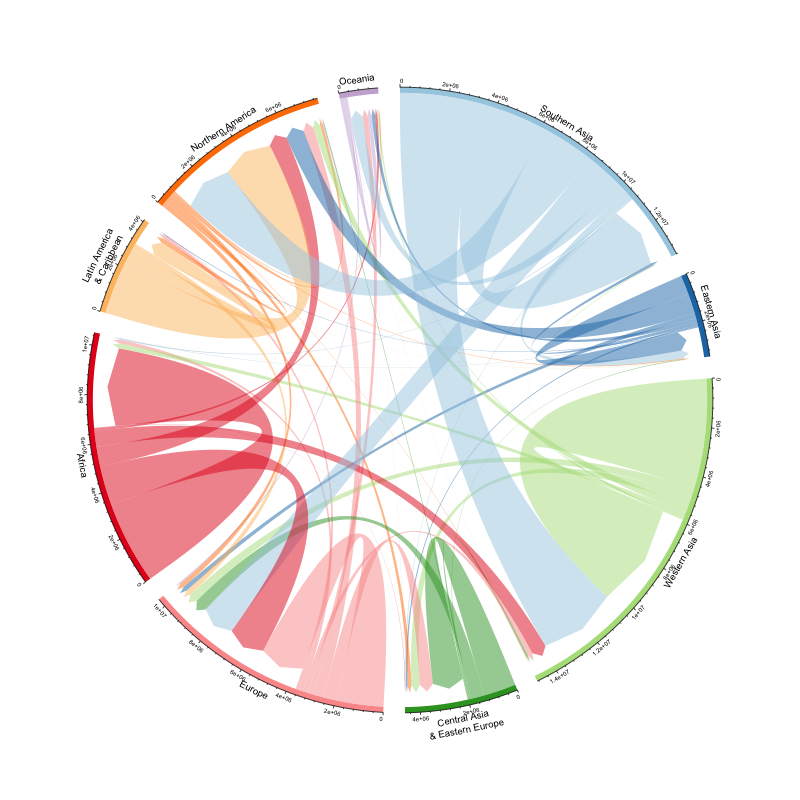

```{r setup, include=FALSE}
knitr::opts_chunk$set(fig.width = 12, message = FALSE, warning = FALSE, comment = "", cache = F)
library(flipbookr)
library(xaringan)
```

## Introduction

- Cover different ways to visualize network or relational data

--

  - Node-edge diagram (classic network visualization) with **`tidygraph`** and **`ggraph`**

--

  - Heat map (plus cluster analysis) with **`ggplot2`** and **`cluster`**


--

- Increasingly popular ways

--

  - Chord diagram with **`circlize`**

--

  - Sankey diagrams with **`ggsankey`** (or alluvial diagram with **`ggalluvial`**) 
  
---

  
## Network visualization

- Map of sciences (Bollen et al. 2009) based on clickstream data on journal websites

```{r, echo = FALSE, out.width='32.5%', fig.align='center'}
knitr::include_graphics("figures/journal.pone.0004803.g005.png")
```

---

## Challenges 

- Network data create many challenges for visualization

--

  - Cursed by high dimensionality

--

  - Network diagrams usually result in hairballs or spaghetti balls. . .

--

- One takeaway from this lab is to take advantage of alternative visualization methods when possible

--

- Not just network data, but more generically, *relational* data

--

  - Any data whose unit of observation is dyadic

--

  - E.g., migration flow data, or import/export data, between a pair of countries

---
  
## Examples in class

- Florentine families and the rise of Medici: node-edge diagram

```{r, echo = FALSE, out.width='65%', fig.align='center'}

```

---

## Examples in class

- Migration flow data: heat map with cluster analysis

```{r, echo = FALSE, out.width='32.5%', fig.align='center'}

```

---

## Examples in class

- Migration flow data: chord diagram

```{r, echo = FALSE, out.width='32.5%', fig.align='center'}

```

---

## Examples in class

- Migration flow data: sankey diagram

```{r, echo = FALSE, out.width='32.5%', fig.align='center'}

```

---

## Prerequisite

```{r}
# download packages 
packages <- c("tidyverse", "tidygraph", "ggraph", "reshape2", "cluster", "circlize")
not_installed <- setdiff(packages, rownames(installed.packages()))
if (length(not_installed)) install.packages(not_installed)

# install developmental version of ggsankey
devtools::install_github("davidsjoberg/ggsankey")

# load packages
library(tidyverse)
library(tidygraph)
library(ggraph)
library(reshape2)
library(cluster)
library(circlize)
library(ggsankey)
```

---

`r chunk_reveal("medici1", break_type = "auto", widths = c(50, 50), title = "## Rise of Medici: Adjacency Matrix")`

```{r "medici1", include = F}
# load data
medici <- read.table("data/medici.txt")

# examine the data
head(medici)
```

---

`r chunk_reveal("medici2", break_type = "auto", widths = c(50, 50), title = "## Rise of Medici: tidygraph package for manipulation")`

```{r "medici2", include = F}
# coerce into a tbl_graph using tidygraph
medici_graph <- as_tbl_graph(medici, directed = FALSE)

# examine the tbl_graph
medici_graph
```

---

`r chunk_reveal("medici3", break_type = "auto", widths = c(50, 50), title = "## Rise of Medici: Basic visualization w/ ggraph")`

```{r "medici3", include = F}
ggraph(medici_graph) +
  geom_node_point() +
  geom_edge_link() +
  geom_node_text(aes(label = name), repel = TRUE) +
  theme_graph()
```

---

`r chunk_reveal("medici4", break_type = "auto", widths = c(50, 50), title = "## Rise of Medici: tidygraph package for network computation")`

```{r "medici4", include = F}
medici_graph %>%
  mutate(
    degree = centrality_degree(), # degree centrality
    community = group_leading_eigen() # community-detection algorithm
  ) ->
  medici_graph
```

---

`r chunk_reveal("medici5", break_type = "non_seq", widths = c(50, 50), title = "## Rise of Medici: Basic visualization w/ ggraph")`

```{r "medici5", include = F}
ggraph(               #BREAK
  medici_graph,       #BREAK
  layout = "circle"   #BREAK9
  ) +                 #BREAK
  geom_edge_link(alpha = 0.5) +  #BREAK2
  geom_node_point(aes(size = degree,            #BREAK3
                      color = factor(community) #BREAK4
                      )) +                      #BREAK3
  geom_node_text(aes(label = name,              #BREAK5
                     size = degree              #BREAK6
                     ),                         #BREAK5
                 repel = TRUE) +                #BREAK5
  scale_color_brewer(palette = "Set1") +        #BREAK7
  theme_graph() + theme(legend.position = "none") #BREAK8
```

---

## Alternative tools for making node-edge diagram

- Check out [Gephi](https://gephi.org/), a free and open-source tool for network visualization 

--

  - Suitable for large-N, complex networks

--

  - From [Martin Grandjean](https://www.martingrandjean.ch/intellectual-cooperation-multi-level-network-analysis/)
  
```{r, echo = FALSE, out.width='42.5%', fig.align='center'}

```

---

`r chunk_reveal("migrat1", break_type = "auto", widths = c(50, 50), title = "## Migration flow: node-edge diagram?")`

```{r "migrat1", include = F}
# load data
migrat2010 <- read_csv("data/migrat2010.csv")

# examine data: long list instead of adjacency matrix 
print(migrat2010)

# coerce to tbl_graph
migrat2010_graph <- as_tbl_graph(migrat2010)
```

---

`r chunk_reveal("migrat2", break_type = "non_seq", widths = c(50, 50), title = "## Migration flow: node-edge diagram?")`

```{r "migrat2", include = F}
ggraph(migrat2010_graph) + #BREAK
  geom_edge_link(                           #BREAK2
    alpha = 0.5,                            #BREAK2
    start_cap = circle(2.5, 'mm'), #BREAK6
    end_cap = circle(2.5, 'mm'), #BREAK7
    arrow = arrow(length = unit(2.5, 'mm')) #BREAK8
  ) + #BREAK2
  geom_node_point() + #BREAK3
  geom_node_text(aes(label = name), repel = TRUE) + #BREAK4
  theme_graph() #BREAK5
```

---

`r chunk_reveal("migrat3", break_type = "auto", widths = c(50, 50), title = "## Migration flow: what about heat map?")`

```{r "migrat3", include = F}
ggplot(migrat2010, aes(y = origRegion, 
                       x = destRegion, 
                       fill = flow)) +
  geom_tile(color = "white", size = 0.2) +
  coord_equal() +
  theme(panel.background = element_blank())
```

---

## Migration flow: improving the heat map 

- Three wrangling and analytical tasks:

  - Make NA values explicit
  
  - Turn flow into a categorical variable 
  
  - Implement cluster analysis to sort countries
  
  
---

`r chunk_reveal("migrat4", break_type = "auto", widths = c(50, 50), title = "## Migration flow: improving the heat map")`

```{r "migrat4", include=F}
# use expand to create all unique combinations of variables
migrat2010 %>%
  expand(origRegion, destRegion) %>%
  left_join(migrat2010, by = c("origRegion", "destRegion")) ->
  migrat2010
```

---

`r chunk_reveal("migrat5", break_type = "auto", widths = c(50, 50), title = "## Migration flow: improving the heat map")`

```{r "migrat5", include=F}
# find appropriate breaks 
quantile(migrat2010$flow, na.rm = TRUE)
breaks <- c(1000, 5000, 10000, 50000, 100000, Inf)
labels <- c("1000-5000", "5000-10000", "10000-50000", 
            "50000-100000", ">100000")

# coerce flow into factors
migrat2010 %>%
  mutate(flowCat = cut(flow, 
                       breaks = breaks, 
                       labels = labels)) ->
  migrat2010
```


---

`r chunk_reveal("migrat6", break_type = "auto", widths = c(50, 50), title = "## Migration flow: improving the heat map")`


```{r "migrat6", include=F}
# coerce long list into matrix
migrat2010 %>%
  reshape2::acast(origRegion ~ destRegion, 
                  value.var = "flow", 
                  fill = 0) ->
  migrat2010_matrix 

# cluster analysis
migrat2010_matrix %>%
  dist() %>%
  hclust(method = "ward.D") ->
  migrat2010_hclust
```

---

`r chunk_reveal("migrat7", break_type = "auto", widths = c(50, 50), title = "## Migration flow: improving the heat map")`


```{r "migrat7", include=F}
# check the order
countryOrder <- migrat2010_hclust$order
names(countryOrder) <- migrat2010_hclust$labels
print(countryOrder)

# sort the countries using the order produced by cluster analysis
countryLevels <- row.names(migrat2010_matrix)[countryOrder]
print(countryLevels)
```

---

`r chunk_reveal("migrat8", break_type = "auto", widths = c(50, 50), title = "## Migration flow: improving the heat map")`

```{r "migrat8", include=F}
# re-level `origRegion` and `destRegion` according to the level
migrat2010 %>%
  mutate(
    origRegion = factor(origRegion, levels = rev(countryLevels)),
    destRegion = factor(destRegion, levels = countryLevels)
  ) ->
  migrat2010
```

---

`r chunk_reveal("migrat9", break_type = "non_seq", widths = c(50, 50), title = "## Migration flow: improving the heat map")`

```{r "migrat9", include=F}
ggplot(migrat2010, #BREAK 
       aes(y = origRegion, x = destRegion, fill = flowCat)) + #BREAK
  geom_tile(color = "white", size = 0.2) + #BREAK2
  scale_fill_brewer(palette = "Blues",       #BREAK3
                    na.value = "grey90") + #BREAK3
  coord_equal() + #BREAK4
  scale_x_discrete(position = "top") + #BREAK5
  theme(                                #BREAK6
    panel.background = element_blank(), #BREAK6
    axis.ticks.x = element_blank(), #BREAK7
    axis.ticks.y = element_blank(), #BREAK7
    axis.text.x.top = element_text(angle = 45, hjust = 0), #BREAK8
    legend.key.height = grid::unit(0.8, "cm"), #BREAK9
    legend.key.width = grid::unit(0.2, "cm") #BREAK9
  ) + #BREAK6
  guides(fill = guide_legend(title = "Migration flow")) + #BREAK9
  labs(y = "Origin", x = "Destination") #BREAK9
```


---

## Migration flow: chord diagram

```{r, echo = FALSE, out.width='35%', fig.align='center'}

```

---

`r chunk_reveal("chord1", break_type = "auto", float = "top", widths = c(90, 10), title = "## Migration flow: chord diagram")`

```{r "chord1", include=F}
# too many unique regions 
unique(migrat2010$origRegion)

# aggregate sub-regions and reduce number of groups
Europe <- c("Southern Europe", "Western Europe", "Northern Europe")
CAEE <- c("Eastern Europe", "Central Asia")
Africa <- c("Eastern Africa", "Middle Africa", "Northern Africa", "Southern Africa", "Western Africa")
LACarib <- c("Central America", "South America", "Caribbean")
SAsia <- c("South-Eastern Asia", "Southern Asia")
```

---

`r chunk_reveal("chord2", break_type = "auto", float = "top", widths = c(90, 10), title = "## Migration flow: chord diagram")`

```{r "chord2", include=F}
# Use mutate() and across() to recode `origRegion` and `destRegion` simultaneously
migrat2010 %>%
  mutate(across(c(origRegion, destRegion), ~ case_when(.x %in% Europe ~ "Europe",
                                                       .x %in% CAEE ~ "Central Asia \n& Eastern Europe",
                                                       .x %in% Africa ~ "Africa",
                                                       .x %in% LACarib ~ "Latin America \n& Caribbean",
                                                       .x %in% SAsia ~ "Southern Asia",
                                                       TRUE ~ as.character(.x)))) %>%
  mutate(across(c(origRegion, destRegion), ~ factor(.x, levels = c("Southern Asia", "Eastern Asia",
                                                                   "Western Asia", "Central Asia \n& Eastern Europe",
                                                                   "Europe", "Africa", "Latin America \n& Caribbean",
                                                                   "Northern America", "Oceania")))) ->
  migrat2010
```

---

`r chunk_reveal("chord3", break_type = "auto", float = "top", widths = c(90, 10), title = "## Migration flow: chord diagram")`

```{r "chord3", include=F}
# collapse (summing) flow values by newly aggregated regions
migrat2010 %>%
  group_by(origRegion, destRegion) %>%
  summarize(flowTotal = sum(flow, na.rm = TRUE)) %>%
  ungroup() ->
  migrat2010
```

---

## Migration flow: chord diagram

```{r "chord4", fig.align="center",  out.width='55%'}
# basic chord diagram
chordDiagram(migrat2010)
```

---

`r chunk_reveal("chord5", break_type = "auto", float = "top", widths = c(90, 10), title = "## Migration flow: improving the chord diagram")`

```{r "chord5", include=F}
# setting parameters
# see details: https://jokergoo.github.io/circlize_book/book/the-chorddiagram-function.html
circos.clear()

circos.par(
  start.degree = 90, # Start at 12 o'clock
  gap.degree = 4, # Increase gaps between sectors
  track.margin = c(-0.1, 0.1), # Narrow the track margin
  points.overflow.warning = FALSE # Subdue warning messages
)

par(mar = rep(0, 4)) # no margins in the plot

# get nice colors
colors <- RColorBrewer::brewer.pal(9, "Paired")
```

---

`r chunk_reveal("chord6", break_type = "non_seq", widths = c(40, 60), title = "## Migration flow: improving the chord diagram")`

```{r "chord6", include=F}
chordDiagram( #BREAK
  migrat2010, #BREAK
  grid.col = colors, #BREAK2
  directional = 1, #BREAK3
  direction.type = c("arrows", "diffHeight"), #BREAK4
  link.arr.type = "big.arrow",  #BREAK5
  diffHeight = -0.04, #BREAK6
  link.sort = TRUE,  #BREAK7
  link.largest.ontop = TRUE #BREAK8
) #BREAK 
```

---

## Migration flow: sankey diagram

- "A sankey diagram is a visualization used to depict a flow from one set of values to another. The things being connected are called nodes and the connections are called links. Sankeys are best used when you want to show a many-to-many mapping between two domains or multiple paths through a set of stages."

```{r, echo = FALSE, out.width='50%', fig.align='center'}
knitr::include_graphics("figures/sankey_diagram.png")
```


---

`r chunk_reveal("sankey1", break_type = "auto", float = "top", widths = c(90, 10), title = "## Migration flow: sankey diagram")`

```{r "sankey1", include=F}
migrat2010 %>%
  mutate(across(c(origRegion, destRegion), ~ str_remove(.x, "\n"))) %>%
  ggsankey::make_long(origRegion, destRegion, value = flowTotal) ->
  migrat2010_sankey 
```

---

`r chunk_reveal("sankey2", break_type = "non_seq", widths = c(55, 45), title = "## Migration flow: sankey diagram")`

```{r "sankey2", include=F}
ggplot(migrat2010_sankey,                         #BREAK
       aes(x = x, next_x = next_x, #BREAK
           node = node, next_node = next_node, #BREAK
           value = value, fill = node)) + #BREAK
  geom_sankey(flow.alpha = 0.6, #BREAK2
              width = 0.01) + #BREAK2
  scale_fill_manual(values = colors) + #BREAK3
  theme_sankey() + #BREAK4
  labs(x = NULL) + #BREAK4
  theme(legend.position = "none") + #BREAK4
  scale_x_discrete(labels = c("Origin", "Destination")) + #BREAK4
  geom_sankey_text(data = filter(migrat2010_sankey, x=="origRegion"), #BREAK5
                   aes(label = paste0(node, "   "), color = node),  #BREAK5
                   hjust = 1 #BREAK6
                   ) + #BREAK5
  geom_sankey_text(data = filter(migrat2010_sankey, x=="destRegion"), #BREAK7
                   aes(label = paste0("   ", node), color = node),  #BREAK7
                   hjust = 0 #BREAK8
                   ) + #BREAK7
  scale_color_manual(values = colors) #BREAK9
```


