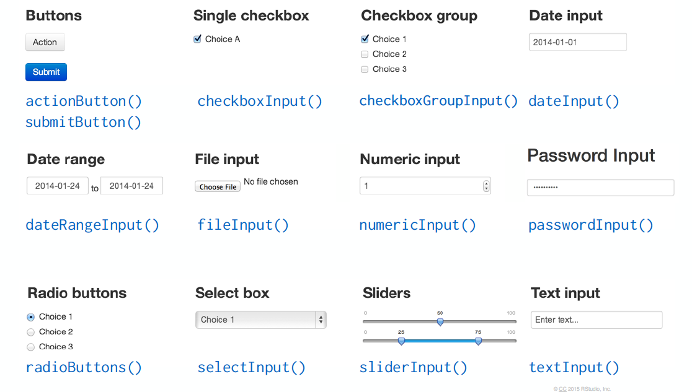
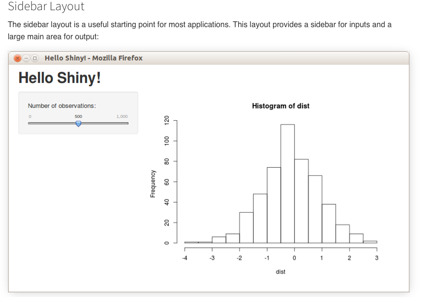
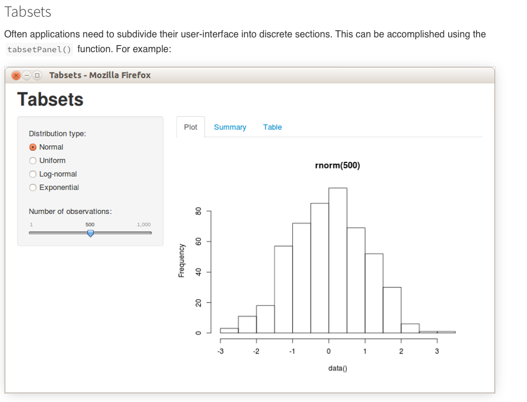

```{r setup, include=FALSE}
knitr::opts_chunk$set(echo = TRUE)
```

## Basic structure of a Shiny app
- Four lines to build a `Shiny` app

\scriptsize
```{r, eval = F}
library(shiny)
ui <- fluidPage(...)
server <- function(input, output) {...}
shinyApp(ui = ui, server = server)
```

\normalsize
1. `ui`: front end interface
    - Inside `fluidPage()` 
    - `Input` and `Output` functions
    - Others: `Layout` functions
2. `server` function: back end logic
    - Access input values via `input$...` **in a reactive context**
    - Create output values via `render()` or `reactive()` **in a reactive context**
      - Within `render()` or `reactive()`, write code to perform some tasks 
      - Store them as elements of `output` via `output$...`
      
## What is reactivity?
- Reactivity: connecting inputs to outputs 
  - Allow outputs to automatically update when an input is changed by the users
  - Output has a *reactive dependency* on input
  - Allow `Shiny` to be responsive but computationally efficient (lazy)
  - You can't read `input$...` or modify `output$...` outside of a reactive context

## Basic `Input` functions
```{r, echo = FALSE, out.width="100%", fig.align="center"}

```
>- Taken from R Studio Shiny tutorial
>- See more in [Shiny Widgets Gallery](https://shiny.rstudio.com/gallery/widget-gallery.html)

## Basic `Output` and `render` functions

  `Output` functions      Insert                 Corresponding `render`
--------------------      ---------------------  ---------------------- 
   dataTableOutput()      an interactive table   renderDataTable()
       imageOutput()      image                  renderImage()
        plotOutput()      plot                   renderPlot()
       tableOutput()      table                  renderTable()
        textOutput()      text                   renderText()
verbatimTextOutput()      text                   renderText()
          uiOutput()      a Shiny UI element     renderUI()
        htmlOutput()      raw HTML               renderUI()
--------------------      --------------------   ---------------------- 

## Practice time!
- Start with these four lines of code:

\scriptsize
```{r, eval = F}
library(shiny)

ui <- fluidPage()

server <- function(input, output) {}

shinyApp(ui = ui, server = server)
```

## Layouts in UI: Sidebar Layout
- See more here [Application layout guide](https://shiny.rstudio.com/articles/layout-guide.html)

\scriptsize
```{r, eval=F}
ui <- fluidPage(

  titlePanel("Hello Shiny!"),

  sidebarLayout(

    sidebarPanel(
      sliderInput("obs", "Number of observations:",  
                  min = 1, max = 1000, value = 500)
    ),

    mainPanel(
      plotOutput("distPlot")
    )
  )
)
```

## Layouts in UI: Sidebar Layout
```{r, echo = FALSE, out.width="100%", fig.align="center"}

```

## Layouts in UI: Tabsets
\scriptsize
```{r, eval=F}
ui <- fluidPage(

  titlePanel("Tabsets"),

  sidebarLayout(
    
    sidebarPanel(
      # Inputs excluded for brevity
    ),
  
    mainPanel(
      tabsetPanel(
        tabPanel("Plot", plotOutput("plot")), 
        tabPanel("Summary", verbatimTextOutput("summary")), 
        tabPanel("Table", tableOutput("table"))
      )
    )
  )
)
```

## Layouts in UI: Tabsets
```{r, echo = FALSE, out.width="100%", fig.align="center"}

```

## Extension packages to check out
- [`plotly`](https://plotly.com/r/) for interactive plots (e.g. hovering over points)
- [`highcharter`](https://jkunst.com/highcharter/) for R wrapper for Highcharts javascript library
- [`shinyWidgets`](https://shinyapps.dreamrs.fr/shinyWidgets/) for even more widgets
- [`shinythemes`](https://rstudio.github.io/shinythemes/) for Shiny themes
- A complete list of extension packages [here](https://github.com/nanxstats/awesome-shiny-extensions)


